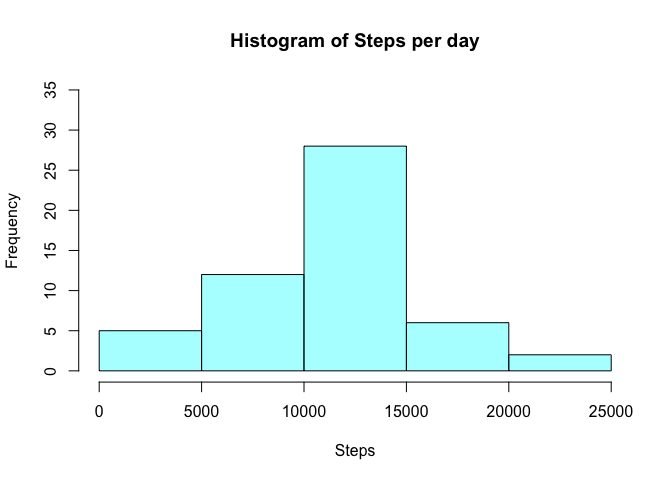
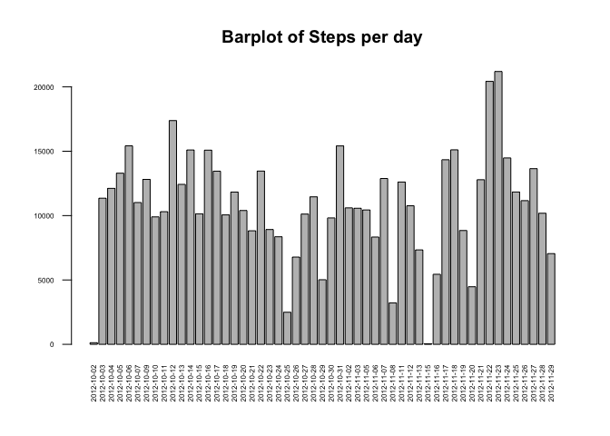
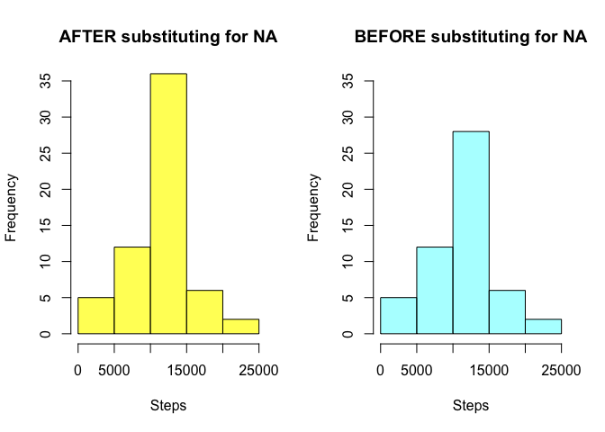
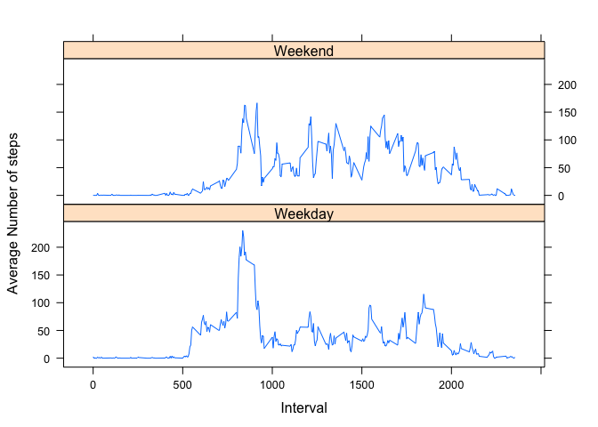

# Reproducible Research: Peer Assessment 1


## Loading and preprocessing the data

```r
fileurl <- "https://d396qusza40orc.cloudfront.net/repdata%2Fdata%2Factivity.zip"
download.file(url=fileurl,destfile="./activity.zip",method="curl")
unzip("./activity.zip")
activity <- read.csv("activity.csv")

#Here is what it looks like
head(activity,10)
```

```
##    steps       date interval
## 1     NA 2012-10-01        0
## 2     NA 2012-10-01        5
## 3     NA 2012-10-01       10
## 4     NA 2012-10-01       15
## 5     NA 2012-10-01       20
## 6     NA 2012-10-01       25
## 7     NA 2012-10-01       30
## 8     NA 2012-10-01       35
## 9     NA 2012-10-01       40
## 10    NA 2012-10-01       45
```


## What is mean total number of steps taken per day?
**1. Calculate the total number of steps taken per day**

```r
library(dplyr)
```

```
## 
## Attaching package: 'dplyr'
## 
## The following objects are masked from 'package:stats':
## 
##     filter, lag
## 
## The following objects are masked from 'package:base':
## 
##     intersect, setdiff, setequal, union
```

```r
tidy_data <- activity %>%  filter(!is.na(steps)) %>% group_by(date) %>% summarise_each(funs(sum))
#Here is what it looks like
head(tidy_data,10)
```

```
## Source: local data frame [10 x 3]
## 
##          date steps interval
##        (fctr) (int)    (int)
## 1  2012-10-02   126   339120
## 2  2012-10-03 11352   339120
## 3  2012-10-04 12116   339120
## 4  2012-10-05 13294   339120
## 5  2012-10-06 15420   339120
## 6  2012-10-07 11015   339120
## 7  2012-10-09 12811   339120
## 8  2012-10-10  9900   339120
## 9  2012-10-11 10304   339120
## 10 2012-10-12 17382   339120
```


**2. If you do not understand the difference between a histogram and a barplot, research the difference between them. Make a histogram of the total number of steps taken each day**

```r
#Histogram
hist(tidy_data$steps, main = "Histogram of Steps per day", xlab = "Steps", col=rgb(0,1,1,0.4), ylim=c(0,35))
```

 

```r
#Here is what a barplot looks like
barplot(tidy_data$steps, names.arg = c(as.character(tidy_data$date)), cex.axis=0.5, cex.names = 0.5 , las=2 , main = "Barplot of Steps per day")
```

 


**3. Calculate and report the mean and median of the total number of steps taken per day**

```r
tidy_data <- activity %>%  filter(!is.na(steps)) %>% group_by(date) %>% summarise_each(funs(sum,mean,median)) %>% select(date,steps_sum,steps_mean,steps_median)
#Here is what it looks like
head(tidy_data,10)
```

```
## Source: local data frame [10 x 4]
## 
##          date steps_sum steps_mean steps_median
##        (fctr)     (int)      (dbl)        (dbl)
## 1  2012-10-02       126    0.43750            0
## 2  2012-10-03     11352   39.41667            0
## 3  2012-10-04     12116   42.06944            0
## 4  2012-10-05     13294   46.15972            0
## 5  2012-10-06     15420   53.54167            0
## 6  2012-10-07     11015   38.24653            0
## 7  2012-10-09     12811   44.48264            0
## 8  2012-10-10      9900   34.37500            0
## 9  2012-10-11     10304   35.77778            0
## 10 2012-10-12     17382   60.35417            0
```


## What is the average daily activity pattern?
**1. Make a time series plot (i.e. type = "l") of the 5-minute interval (x-axis) and the average number of steps taken, averaged across all days (y-axis)**

```r
tidy_data1 <- activity %>%  filter(!is.na(steps) ) %>% select(interval,steps) %>% group_by(interval) %>% summarise_each(funs(mean))

plot(tidy_data1$interval,tidy_data1$steps,type = "l",ylab = "Average across dates",xlab = "Interval", cex.axis=0.5)
```

 


**2. Which 5-minute interval, on average across all the days in the dataset, contains the maximum number of steps?**

```r
tidy_data1  %>%  filter( steps == max(steps))
```

```
## Source: local data frame [1 x 2]
## 
##   interval    steps
##      (int)    (dbl)
## 1      835 206.1698
```


## Imputing missing values
**1. Calculate and report the total number of missing values in the dataset (i.e. the total number of rows with NAs)**

```r
activity %>%  filter(is.na(steps) ) %>% nrow()
```

```
## [1] 2304
```


**2. Devise a strategy for filling in all of the missing values in the dataset. The strategy does not need to be sophisticated. For example, you could use the mean/median for that day, or the mean for that 5-minute interval, etc.**

<i><span style="color:blue">The strategy I have used is to replace the 'NA' with the mean steps for that particualr interval across all days. Here is how its implemented in code:</span></i>

```r
chkaa <- merge(activity, tidy_data1, by.x = "interval", by.y = "interval")
names(chkaa)[2]<-"steps"
names(chkaa)[4]<-"meansteps"
names(chkaa)[3]<- "date"
```


**3. Create a new dataset that is equal to the original dataset but with the missing data filled in.**

```r
chkaa1 <- chkaa %>% mutate(steps = ifelse(is.na(steps),meansteps,steps)) %>% select(date,steps,interval)
#Here is what it looks like
head(chkaa1,10)
```

```
##          date    steps interval
## 1  2012-10-01 1.716981        0
## 2  2012-11-23 0.000000        0
## 3  2012-10-28 0.000000        0
## 4  2012-11-06 0.000000        0
## 5  2012-11-24 0.000000        0
## 6  2012-11-15 0.000000        0
## 7  2012-10-20 0.000000        0
## 8  2012-11-16 0.000000        0
## 9  2012-11-07 0.000000        0
## 10 2012-11-25 0.000000        0
```


**4. Make a histogram of the total number of steps taken each day and Calculate and report the mean and median total number of steps taken per day. Do these values differ from the estimates from the first part of the assignment? What is the impact of imputing missing data on the estimates of the total daily number of steps?**

```r
chkaa2 <- chkaa1 %>% group_by(date) %>% summarise_each(funs(sum,mean,median)) %>% select(date,steps_sum,steps_mean,steps_median)

#Plotting graphs for comparison side-by-side
par(mfcol = c(1,2))
hist(chkaa2$steps_sum, main = "AFTER substituting for NA", ylim=c(0,35),xlab = "Steps", col=rgb(1,1,0,0.7))
hist(tidy_data$steps_sum, ylim=c(0,35),  col=rgb(0,1,1,0.4), main = "BEFORE substituting for NA", xlab = "Steps")
```

 

```r
#Plotting graphs for comparison by overlaying on top of each other
par(mfcol = c(1,1))
hist(chkaa2$steps_sum, main = "Overlaying Histogram of Steps per day -- BEFORE & AFTER", ylim=c(0,35),xlab = "Steps", col=rgb(1,1,0,0.7))
par(new=TRUE)
hist(tidy_data$steps_sum, ylim=c(0,35),axes = FALSE, labels = FALSE, col=rgb(0,1,1,0.4), main = NULL, xlab = NULL)
legend("topright", c("BEFORE","AFTER","OVERLAP"), lty = c(1,1,1) , lwd=10, col=c(rgb(0,1,1,0.4),rgb(1,1,0,0.7),rgb(0,1,0,0.4)), bty = "n" )
```

 

<i><span style="color:blue">The frequency of steps between 10000 - 15000 only increased, rest of it is exactly similar.</span></i>


```r
#Here is a what the sum, mean, median data looks like:
head(chkaa2,10)
```

```
## Source: local data frame [10 x 4]
## 
##          date steps_sum steps_mean steps_median
##        (fctr)     (dbl)      (dbl)        (dbl)
## 1  2012-10-01  10766.19   37.38260     34.11321
## 2  2012-10-02    126.00    0.43750      0.00000
## 3  2012-10-03  11352.00   39.41667      0.00000
## 4  2012-10-04  12116.00   42.06944      0.00000
## 5  2012-10-05  13294.00   46.15972      0.00000
## 6  2012-10-06  15420.00   53.54167      0.00000
## 7  2012-10-07  11015.00   38.24653      0.00000
## 8  2012-10-08  10766.19   37.38260     34.11321
## 9  2012-10-09  12811.00   44.48264      0.00000
## 10 2012-10-10   9900.00   34.37500      0.00000
```


## Are there differences in activity patterns between weekdays and weekends?
**1. Create a new factor variable in the dataset with two levels "weekday" and "weekend" indicating whether a given date is a weekday or weekend day.**

```r
library(timeDate)
wkday <- chkaa1 %>% mutate(daydate = ifelse(isWeekday(as.Date(chkaa1$date)),"Weekday","Weekend")) %>% select(date,daydate,steps,interval)
#Here is what it looks like
head(wkday,10)
```

```
##          date daydate    steps interval
## 1  2012-10-01 Weekday 1.716981        0
## 2  2012-11-23 Weekday 0.000000        0
## 3  2012-10-28 Weekend 0.000000        0
## 4  2012-11-06 Weekday 0.000000        0
## 5  2012-11-24 Weekend 0.000000        0
## 6  2012-11-15 Weekday 0.000000        0
## 7  2012-10-20 Weekend 0.000000        0
## 8  2012-11-16 Weekday 0.000000        0
## 9  2012-11-07 Weekday 0.000000        0
## 10 2012-11-25 Weekend 0.000000        0
```


**2. Make a panel plot containing a time series plot (i.e. type = "l") of the 5-minute interval (x-axis) and the average number of steps taken, averaged across all weekday days or weekend days (y-axis). See the README file in the GitHub repository to see an example of what this plot should look like using simulated data.**

```r
library(lattice)
chkaa3 <- wkday %>% select(daydate,interval,steps) %>% group_by(daydate,interval) %>% summarise_each(funs(mean))
xyplot(chkaa3$steps ~ chkaa3$interval| chkaa3$daydate , type = "l",ylab = "Average Number of steps",xlab = "Interval", cex.axis=0.5 , layout= c(1,2))
```

 

